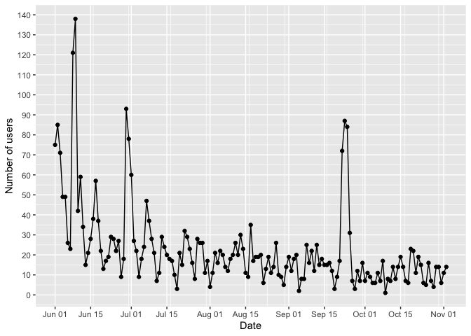
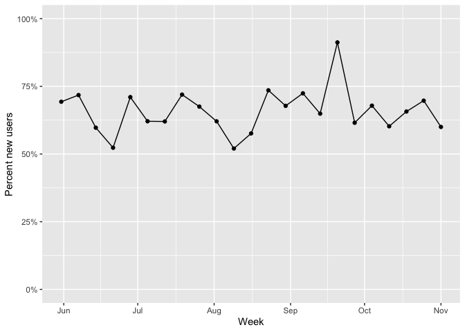
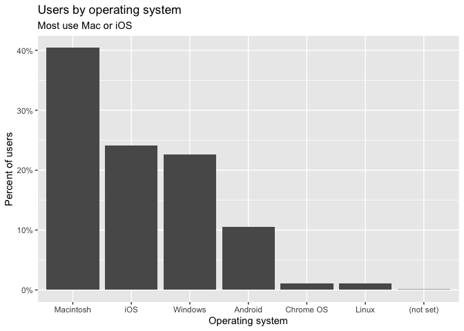
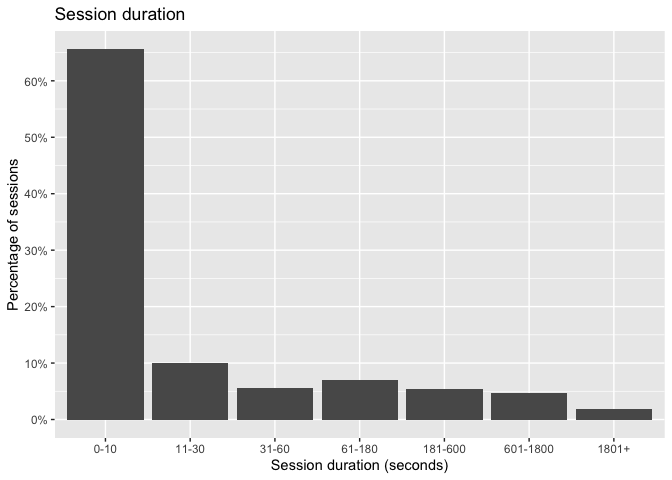
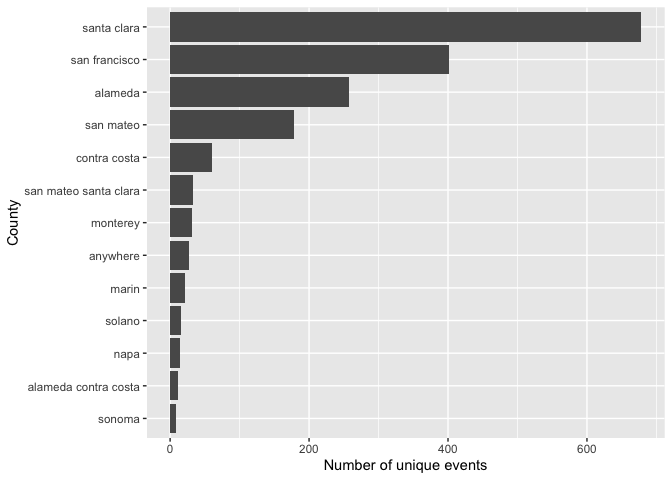
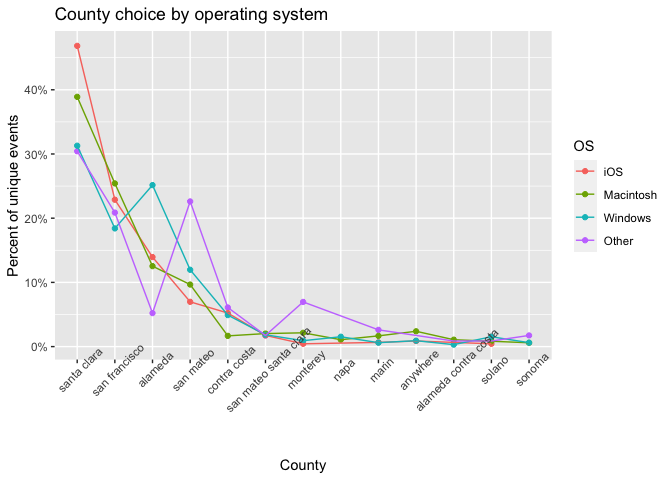
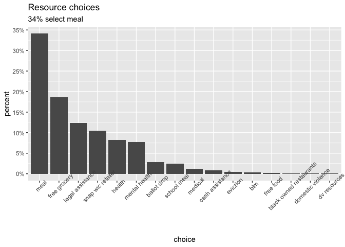

Bay Area Community Analytics
================
Sara Altman
2020-11-03

  - [Users over time](#users-over-time)
  - [Operating systems](#operating-systems)
  - [Time spent on the site](#time-spent-on-the-site)
  - [Events](#events)
      - [Counties](#counties)
      - [Counties by OS](#counties-by-os)
      - [Resources](#resources)

``` r
# Libraries
library(tidyverse)
library(lubridate)

# Parameters
file_users <- here::here("data/site_users.rds")
file_duration <- here::here("data/duration.rds")
file_events <- here::here("data/events.rds")
#===============================================================================

users <-
  file_users %>% 
  read_rds()

duration <-
  file_duration %>% 
  read_rds()

events <-
  file_events %>% 
  read_rds()
```

## Users over time

``` r
users %>% 
  count(date, wt = users) %>% 
  ggplot(aes(date, n)) +
  geom_point() +
  geom_line() +
  scale_x_date(
    date_labels = "%b %d", 
    breaks = 
      c(
        unique(floor_date(users$date, unit = "month")), 
        unique(floor_date(users$date, unit = "month")) + 14
      )
  ) +
  scale_y_continuous(breaks = scales::breaks_width(10)) +
  labs(
    x = "Date",
    y = "Number of users"
  )
```

<!-- -->

``` r
users %>% 
  group_by(week = floor_date(date, unit = "week")) %>%
  summarize(new_users = sum(new_users) / sum(users)) %>%
  ggplot(aes(week, new_users)) +
  geom_line() +
  geom_point() +
  scale_y_continuous(
    limits = c(0, 1), 
    labels = scales::label_percent()
  ) +
  labs(
    x = "Week",
    y = "Percent new users"
  )
```

    ## `summarise()` ungrouping output (override with `.groups` argument)

<!-- -->

## Operating systems

``` r
users %>% 
  count(operating_system, wt = users) %>% 
  mutate(
    percent = n / sum(n),
    operating_system = fct_reorder(operating_system, n, .desc = TRUE)
  ) %>% 
  ggplot(aes(operating_system, percent)) +
  geom_col() +
  scale_y_continuous(
    labels = scales::label_percent(accuracy = 1), 
    breaks = scales::breaks_width(0.1)
  ) +
  labs(
    x = "Operating system",
    y = "Percent of users",
    title = "Users by operating system",
    subtitle = "Most use Mac or iOS"
  )
```

<!-- -->

## Time spent on the site

``` r
duration %>% 
  mutate(
    percentage = sessions/sum(sessions),
    duration_min = 
      as.double(str_extract(session_duration, "^\\d+")),
    session_duration = 
      str_remove(session_duration, " seconds") %>% 
      fct_reorder(duration_min) 
  ) %>% 
  ggplot(aes(session_duration, percentage)) +
  geom_col() +
  scale_y_continuous(
    labels = scales::label_percent(accuracy = 1),
    breaks = scales::breaks_width(width = 0.1)
  ) +
  labs(
    x = "Session duration (seconds)",
    y = "Percentage of sessions",
    title = "Session duration"
  )
```

<!-- -->

## Events

### Counties

``` r
events %>% 
  filter(type == "county") %>% 
  count(choice, wt = unique_events) %>% 
  mutate(choice = fct_reorder(choice, n)) %>% 
  ggplot(aes(choice, n)) +
  geom_col() +
  coord_flip() +
  labs(
    x = "County",
    y = "Number of unique events"
  )
```

<!-- -->

### Counties by OS

``` r
events %>% 
  filter(type == "county") %>% 
  mutate(
    operating_system = 
      fct_collapse(
        operating_system, 
        "Other" = c("Android", "Chrome OS", "Linux")
      ) 
  ) %>% 
  group_by(operating_system, choice) %>%
  summarize(across(c(contains("event"), contains("value")), sum)) %>% 
  mutate(
    percent = unique_events / sum(unique_events)
  ) %>% 
  ungroup() %>% 
  mutate(
    choice = fct_reorder(choice, percent, .desc = TRUE),
    operating_system = 
      fct_reorder2(operating_system, choice, percent, .desc = FALSE)
  ) %>% 
  ggplot(
    aes(choice, percent, color = operating_system, group = operating_system)
  ) +
  geom_point() +
  geom_line() +
  scale_y_continuous(labels = scales::label_percent(accuracy = 1)) +
  theme(axis.text.x = element_text(angle = 45)) +
  labs(
    x = "County",
    y = "Percent of unique events",
    color = "OS",
    title = "County choice by operating system"
  ) 
```

    ## `summarise()` regrouping output by 'operating_system' (override with `.groups` argument)

<!-- -->

### Resources

``` r
v <-
  events %>% 
  filter(type == "resource") %>% 
  mutate(
    choice = 
      fct_collapse(
        choice, 
        "blm" = "blm statement", 
        "eviction" = "eviction resources"
      )
  ) %>% 
  count(choice, wt = unique_events) %>% 
  mutate(
    percent = n / sum(n),
    choice = fct_reorder(choice, n, .desc = TRUE)
  ) 

top_choice <- 
  v %>% 
  slice_max(percent)

v %>% 
  ggplot(aes(choice, percent)) +
  geom_col() +
  scale_y_continuous(
    labels = scales::label_percent(accuracy = 1),
    breaks = scales::breaks_width(0.05)
  ) +
  theme(axis.text.x = element_text(angle = 45)) +
  labs(
    title = "Resource choices",
    subtitle = 
      str_glue(
        "{round(top_choice$percent * 100)}% select {top_choice$choice}"
      )
  )
```

<!-- -->
