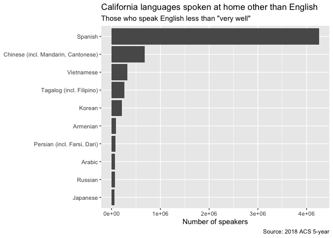

California languages spoken at home other than English
================
Bill Behrman
2020-06-28

  - [All English abilities](#all-english-abilities)
  - [Those who speak English less than “very
    well”](#those-who-speak-english-less-than-very-well)

``` r
# Libraries
library(tidyverse)

# Parameters
  # ACS year
YEAR <- 2018
  # ACS table for language spoken at home by ability to speak English
TABLE <- "B16001"
  # State
STATE <- "California"

#===============================================================================

vars <- 
  tidycensus::load_variables(year = YEAR, dataset = "acs5") %>% 
  filter(str_detect(name, TABLE)) %>% 
  transmute(
    variable = name,
    label = label %>% str_remove("^Estimate!!Total!!")
  )

languages <- 
  tidycensus::get_acs(
    geography = "state",
    variables = vars$variable,
    year = YEAR,
    state = STATE,
    survey = "acs5"
  ) %>% 
  left_join(vars, by = "variable") %>% 
  select(language = label, n = estimate)
```

## All English abilities

``` r
v <- 
  languages %>% 
  filter(!str_detect(language, "!!"), language != "Speak only English") %>% 
  arrange(desc(n))

v %>% 
  slice(1:10) %>% 
  ggplot(aes(fct_reorder(language, n), n)) +
  geom_col() + 
  coord_flip() +
  labs(
    title = "California languages spoken at home other than English",
    subtitle = "All English abilities",
    x = NULL,
    y = "Number of speakers",
    caption = "Source: 2018 ACS 5-year"
  )
```


## Those who speak English less than “very well”

``` r
v <- 
  languages %>% 
  filter(str_detect(language, "less than")) %>% 
  mutate(language = language %>% str_remove("!!.*")) %>% 
  arrange(desc(n))

v %>% 
  slice(1:10) %>% 
  ggplot(aes(fct_reorder(language, n), n)) +
  geom_col() + 
  coord_flip() +
  labs(
    title = "California languages spoken at home other than English",
    subtitle = 'Those who speak English less than "very well"',
    x = NULL,
    y = "Number of speakers",
    caption = "Source: 2018 ACS 5-year"
  )
```


