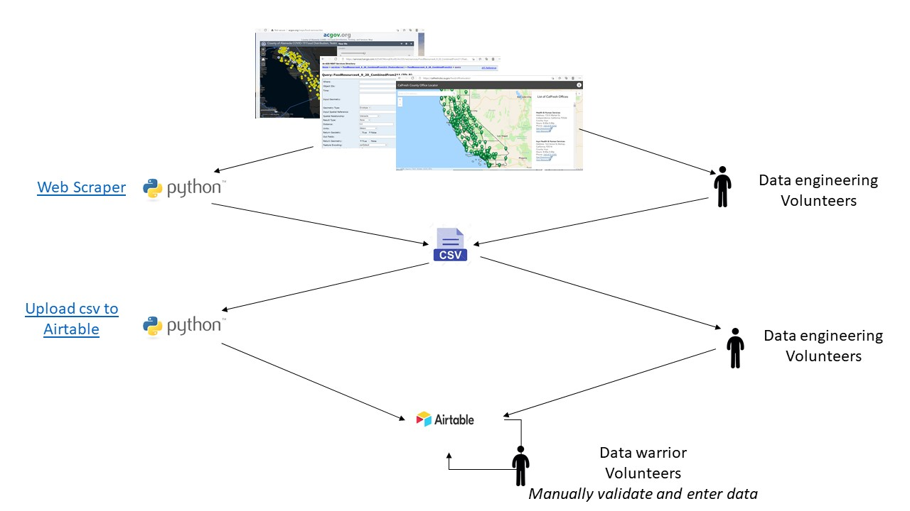
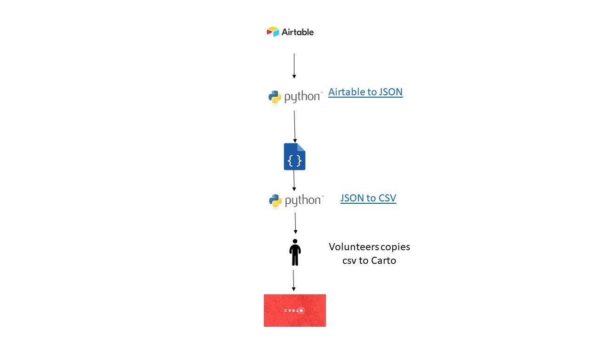

# Data flow

# Faq
## What is a Web Scraper program?

[Web Scraper](https://github.com/dcl-covid-19/mega-map/tree/master/web-scraping/county-scraping)  is data scraping program written in python to _extract data_ from county websites to csv. 

## What is Upload csv to Airtable?

[Upload csv to Airtable](https://github.com/dcl-covid-19/mega-map/tree/master/web-scraping/county-scraping) is python program written to _transform data_ to match Airtable structures and _upload_ to Airtable. Airtable is a graph database and has 6 tables.

 Tables: services, organizations, locations, phone, address, and schedule.

[Test database](https://airtable.com/tblWYoMnoqDybw9gM/viweaIk6Qu78D8hkB?blocks=bipy2kL8bU7xoeUba)

[Production database](https://airtable.com/tbl6O0Dq4Kviezxod/viwj59HhaaPTWDJdK?blocks=hide)

## What is Airtable to JSON?

[Airtable to JSON](https://github.com/dcl-covid-19/bac-airtable-to-csv/blob/master/airtable_to_json.py) is python program written to _extract data_ from Airtable to Json.

## What is JSON to CSV?

[JSON to CSV](https://github.com/dcl-covid-19/bac-airtable-to-csv/blob/master/json_to_csv.py) is python program written to _convert data_ from Json to Csv.

## What is Airtable?

Airtable is a graph database. For documentation see [here](https://airtable.com/appr1xuf08nFiiLTF/api/docs#curl/metadata)

## What is Carto?

[Carto](https://dcl-mega-map.carto.com/tables/airtable/public) is a relational database. For documentation [here](https://docs.carto.com/)

## Why do we have one table in CARTO but 6 different tables in airtable?

We are trying to make our Airtable adhere to the [HSDS](http://docs.openreferral.org/en/latest/hsds/) data structure! Many social service orgs use HSDS, so having our sharable Airtable API be in HSDS would ideally help us partner with and more easily integrate the data structures of local social service organizations. HSDS includes several tables. Our CARTO strucute is not HSDS because we chose to move to HSDS after we had built our CARTO backend. Instead of refactoring CARTO and our entire website (coded in Vue JS) we decided the make a script to transform Airtable’s HSDS structure to the CARTO structure we had made up at the outset of this project.

## Why can’t we go directly to CARTO tables?

Because we rely on volunteer data entry and validation, Airtable is a user-friendly and accessible place for volunteers to plug in and make changes! Ideally, partners could also use Airtable to update our database. CARTO would be a less accessible interface for data work by volunteers and partners.
